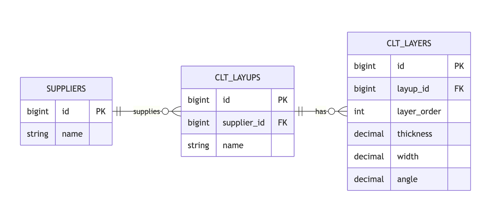

# Feature Test Assignment

## 1. Instructions

- Clone or fork this repository.
- Create a new branch: `{user}-assignment`.
- Invite **@ikhsan017** and **@dhiaaziz** as collaborators.
- Follow the setup instructions provided in the repository before running the project.

## 2. Feature Requirements

### Core Features (Main Criteria)

- [ ] CRUD Suppliers
- [ ] CRUD CLT Layups (nested under Supplier)
- [ ] CRUD CLT Layers (nested under Layup)

The structure should properly reflect the hierarchy:
Supplier → Layups → Layers

### Data Model (ERD)

Below is the Entity Relationship Diagram (ERD) representing the data structure:

### Import / Export (Main Criteria)

- [ ] **Export by Supplier**
    - Must include: Supplier + all related Layups + all related Layers

- [ ] **Import by Supplier**
    - Must create and/or update Layups and Layers under the specified supplier

Format is flexible (JSON / CSV / Excel, etc.). JSON format is completely acceptable.

## 3. Feature: Conflict Resolution (Bonus – Important)

During import, conflicts may occur when incoming data differs from existing records.

### Conflict Detection Rules

#### 1. Layup-Level Conflict

If a layup with the same `name` already exists under the same supplier:

- Treat it as the same layup candidate.
- Do **not** automatically create a new layup.

#### 2. Layer-Level Conflict

If:

- A layer with the same `layer_order` exists within that layup,
- **AND** one or more fields differ (`thickness`, `width`, `angle`),

→ This must be treated as a conflict.

---

### Required Conflict Handling

You must implement a clearly defined conflict resolution strategy.

At minimum, support **one** of the following:

- **Overwrite Existing**  
  (Incoming data replaces current data)

- **Skip Conflict**  
  (Keep current data, ignore incoming change)

- **Duplicate Layup**  
  (Create a new layup with a suffix such as `name (imported)`)

- **Reject Entire Import**  
  (Abort and return a detailed conflict report)

---

### Advanced Conflict Resolution (UI-Based – Bonus)

For additional bonus points, implement a **manual conflict resolution interface** similar to GitHub merge conflict resolution.

Expected behavior:

- Display **Existing Version (Current Data)** and  
  **Incoming Version (Imported Data)** side-by-side
- Highlight field-level differences
- Allow the user to choose:
    - ✅ Keep Existing
    - ✅ Accept Incoming
- Support resolving conflicts one-by-one
- Provide navigation (e.g., “1 of 3 discrepancies”)

This may be implemented as:

- A modal, or
- A dedicated conflict resolution page.

## 4. Design Reference

A design reference is available in Figma:

[Figma Design File](https://www.figma.com/design/odWJ887r00aslmSFPIHMCx/SPEC-Toolbox---Feature-Test?node-id=11001-35&t=XUggOaUUi9p8jGFG-1)

> The design is for reference only. Exact visual matching is not required.

## 5. Evaluation Criteria

### Main Evaluation

- Correct implementation of the required features

### Bonus Evaluation

**Architecture & Design Patterns**

- Use Repository and/or Service pattern
- Bind interfaces via a Service Provider

**Laravel Best Practices**

- Form Request validation
- Policies or Gates for authorization
- Proper use of Route Model Binding
- Clean, maintainable code following Laravel conventions

**Automated Testing**

- Unit tests (validation, services, repositories)
- Feature tests (CRUD and import/export flows)

**Additional Improvements**

- Any meaningful enhancements will be considered positively

## 6. Submission

The deadline will be provided via email.  
Please ensure submission within the specified timeframe.

## 7. Demo

Include one of the following with your submission:

- A demo video (recommended), or
- A live project link

Ensure the demo clearly showcases:

- CRUD functionality
- Import / Export feature
- Conflict resolution behavior
